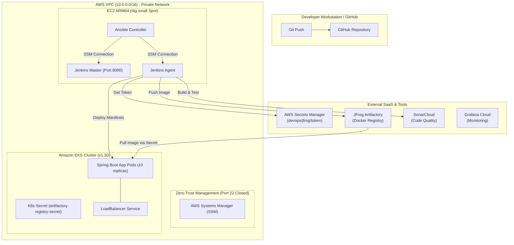

# End-to-End Enterprise DevOps Project on AWS


This repository contains the complete Infrastructure-as-Code (IaC), Configuration Management, CI/CD Pipeline, and Kubernetes deployment architecture for building and running an enterprise-grade cloud application on Amazon Web Services (AWS).

---

## 🏛️ System Architecture



---

## 📁 Repository Structure

```
.
├── .gitignore                          # Excludes tfstate, binaries, target/
├── Dockerfile                          # JRE 17 container image for Spring Boot
├── pom.xml                             # Maven build with JaCoCo & SonarCloud plugins
│
├── ansible/                            # Configuration Management over AWS SSM
│   ├── ansible.cfg                     # Timeouts, privilege escalation & suppressions
│   ├── inventory.ini                   # Generated SSM inventory from S3
│   ├── jenkins-master.yml              # Provisions OpenJDK 21 & Jenkins Master service
│   └── jenkins-agents.yml              # Provisions Maven, Docker, AWS CLI, kubectl
│
├── application/ -> src/                # Spring Boot REST Application (Java 17)
│   ├── main/java/com/satish/demo/      # Main Application & REST Controller (/trends)
│   ├── main/resources/                 # application.properties (port 8000)
│   └── test/java/com/satish/demo/      # JUnit 4 & JUnit 5 Integration Tests
│
├── jenkins/
│   └── Jenkinsfile                     # Declarative 6-stage CI/CD Pipeline
│
├── k8s/                                # Production Kubernetes Manifests
│   ├── deployment.yaml                 # 3 Replicas with imagePullSecrets & port 8000
│   └── service.yaml                    # LoadBalancer Service routing to port 8000
│
├── terraform/                          # Base Infrastructure Stack
│   ├── versions.tf                     # AWS Provider configuration
│   ├── variables.tf                    # Region, instance sizing, AMI
│   ├── vpc.tf                          # Multi-AZ VPC, NAT Gateway, Route Tables
│   ├── security.tf                     # Zero-trust security groups
│   ├── iam.tf                          # SSM instance profile & Secrets Manager access
│   ├── s3.tf                           # S3 staging bucket for Ansible & SSM artifacts
│   ├── compute.tf                      # Spot EC2 instances & automated Controller user_data
│   ├── inventory.tf                    # Generates and uploads inventory.ini to S3
│   └── output.tf                       # Instance IDs and Private IPs
│
└── terraform/kubernetes/               # EKS & Foundational Cluster Stack
    ├── versions.tf                     # AWS, Kubernetes & Helm Providers
    ├── variables.tf                    # Cluster parameters & Artifactory credentials
    ├── data.tf                         # Dynamic lookup for VPC and private subnets
    ├── eks.tf                          # EKS Cluster v20 with Spot Managed Node Groups
    ├── secrets.tf                      # Creates artifactory-registry-secret from AWS Secrets Manager
    └── monitoring.tf                   # Prometheus remote_write to Grafana Cloud
```

---

## 🚀 Step-by-Step Deployment Guide

### Phase 1: Base Infrastructure (`terraform/`)

Provisions the VPC, subnets, NAT Gateway, S3 buckets, IAM roles, and EC2 Spot instances for Jenkins.

```bash
cd terraform/
terraform init
terraform plan
terraform apply -auto-approve
```

---

### Phase 2: Configuration Management (`ansible/`)

Connect to the **Ansible Controller** without SSH keys using **AWS SSM Session Manager**:

```powershell
aws ssm start-session --target <ANSIBLE_CONTROLLER_ID> --region ap-southeast-1 --no-verify-ssl
```

Once inside the Controller:
```bash
sudo su - ubuntu
cd complete-devops-tool-project/ansible

# 1. Test SSM connectivity to Jenkins Master and Agent
ansible all -i inventory.ini -m ping

# 2. Deploy Jenkins Master (Installs OpenJDK 21 & Jenkins)
ansible-playbook -i inventory.ini jenkins-master.yml

# 3. Deploy Jenkins Agent (Installs Maven, Docker, AWS CLI, kubectl)
ansible-playbook -i inventory.ini jenkins-agents.yml
```

#### Accessing Jenkins UI
From your local workstation, open an SSM Port Forwarding tunnel:
```powershell
aws ssm start-session `
  --target <JENKINS_MASTER_INSTANCE_ID> `
  --document-name AWS-StartPortForwardingSession `
  --parameters '{"portNumber":["8080"],"localPortNumber":["8080"]}' `
  --region ap-southeast-1
```
Open **`http://localhost:8080`** in your browser and unlock Jenkins using the initial password:
```bash
sudo cat /var/lib/jenkins/secrets/initialAdminPassword
```

---

### Phase 3: EKS Cluster & Secret Generation (`terraform/kubernetes/`)

Provisions the EKS Cluster and automatically creates the Kubernetes Docker registry secret using the token stored in **AWS Secrets Manager**:

```bash
cd terraform/kubernetes/
terraform init
terraform plan
terraform apply -auto-approve
```

Verify your cluster connectivity:
```bash
aws eks update-kubeconfig --name DevOps-Project --region ap-southeast-1
kubectl get nodes
kubectl get secret artifactory-registry-secret
```

---

### Phase 4: CI/CD Pipeline Execution (`Jenkinsfile`)

Push your code to GitHub:
```bash
git add .
git commit -m "feat: complete devops pipeline configuration"
git push origin main
```

Create a **Pipeline Job** in Jenkins pointing to your repository's `Jenkinsfile`.

#### Pipeline Stages:
1. **Checkout**: Pulls the source code from Git.
2. **Build & Test**: Compiles and executes JUnit tests with `mvn clean package`.
3. **SonarCloud Analysis**: Analyzes code quality and JaCoCo test coverage with `mvn sonar:sonar`.
4. **Quality Gate**: Blocks deployment if code quality or test coverage fails SonarCloud gates.
5. **Docker Build & Push**:
   - Fetches the JFrog API token from AWS Secrets Manager (`devops/jfrog/token`).
   - Authenticates against `irfannoorh.jfrog.io`.
   - Builds the Docker image and pushes both `${BUILD_NUMBER}` and `latest` tags.
6. **Deploy to EKS**:
   - Updates kubeconfig for `DevOps-Project`.
   - Deploys [k8s/deployment.yaml](file:///c:/Users/70R5145/Downloads/complete-devops-tool-project/k8s/deployment.yaml) and [k8s/service.yaml](file:///c:/Users/70R5145/Downloads/complete-devops-tool-project/k8s/service.yaml).
   - Validates rollout with `kubectl rollout status deployment/devops-complete-tool`.

---

## 🔍 Verification & Testing

### 1. Check Pod Health
```bash
kubectl get pods -l app=devops-complete-tool
```

### 2. Verify Application Logs
```bash
kubectl logs -l app=devops-complete-tool -f
```

### 3. Access Live Application
Find the AWS LoadBalancer DNS name:
```bash
kubectl get svc devops-complete-service
```
Test the REST endpoints:
```bash
# Health check endpoint
curl http://<EXTERNAL-IP>/

# Twitter trends endpoint
curl "http://<EXTERNAL-IP>/trends?placeid=1&count=5"
```

---

## 🔒 Key Security & Architectural Highlights

- **Zero Open Inbound Ports**: Port 22 is closed across all security groups. Administration is handled strictly over encrypted **AWS Systems Manager (SSM)** channels.
- **ARM64 Graviton Optimization**: EC2 instances and EKS worker nodes use `t4g.*` Graviton processors on Spot pricing, providing high performance at ~70% cost reduction.
- **Decoupled Infrastructure & Pipeline**: EKS provisioning is handled in Terraform, leaving Jenkins with least-privilege permissions solely focused on rolling updates.
- **Dynamic Secret Injection**: No passwords or tokens are stored in Git. All registry credentials are automatically fetched from **AWS Secrets Manager** at runtime.
- **Full Observability**: Cluster metrics flow outward via Prometheus `remote_write` directly to **Grafana Cloud**, eliminating the need for public in-cluster monitoring ingresses.
